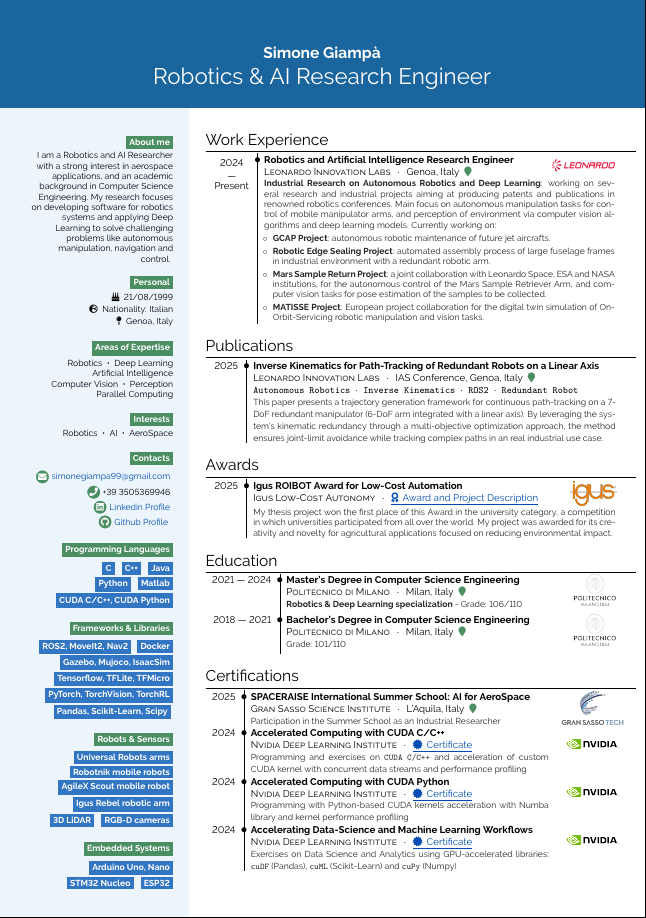

# 🤖 Robotics & AI Research Engineer 

## About Me

I am a Robotics and AI Researcher with a strong interest in aerospace applications, and an academic
background in Computer Science Engineering. My research focuses on developing software for robotics
systems and applying Deep Learning to solve challenging problems like autonomous manipulation, navigation and control.

Currently working and focusing on:

- Autonomous Robotic Manipulation and Control
- Computer Vision and Perception Algorithms
- Deep Learning for Pose Estimation and Object Detection
- Robot Simulations and Digital Twins

## 🛠️ Technical Expertise

| Domain | Tech Stack |
| ---: | :--- |
| **Programming Languages** | C, C++, Python, Java, MATLAB |
| **Robotics Frameworks** | ROS2, MoveIt2, Nav2 |
| **Robotics Simulators** | Gazebo, Isaac Sim, MuJoCo |
| **Deep Learning Frameworks** | PyTorch, TensorFlow, Keras, TorchVision, TorchRL, TFLite, TFMicro |
| **Computer Vision Libraries** | OpenCV, PCL, Open3D |
| **Numerical Computation & Data Analysis** | NumPy, SciPy, Pandas, Matplotlib, Seaborn |
| **Machine Learning Libraries** | Scikit-learn, XGBoost, RiverML |
| **Microcontrollers & Embedded Systems** | Arduino UNO, Arduino NANO, STM32, ESP32 |
| **Version Control & CI/CD** | Git, GitHub, GitLab |
| **Operating Systems** | Linux (Ubuntu), Windows |
| **Virtualization & Containerization** | Docker, VirtualBox |

## Robots and Platforms I've Worked With

- Universal Robots: UR5e, UR20
- Robotnik Mobile Manipulators: RB-KAIROS
- AgileX Robotics Mobile bases: Scout, Bunker
- Igus Robotic Arm: Rebel 6DOF

## Sensors I've Worked With

- RGB-D Cameras: Intel RealSense cameras, ZED cameras, Allied Vision cameras
- 2D Lidars: Hokuyo, RPLIDAR
- 3D Lidars: Velodyne, Ouster

## Master's Thesis Project

**Development of an Autonomous Mobile Manipulator for Industrial and Agricultural Environments**

Read it in the [Polimi Archive](https://hdl.handle.net/10589/223386).

Repositories:
- [Mobile Manipulation with Scout and Rebel](https://github.com/AIRLab-POLIMI/mobile-manipulation-scout-rebel)
- [Autonomous Navigation with Nav2 and Scout Robot](https://github.com/AIRLab-POLIMI/scout_nav2)
- [ROS2 Driver for Igus Rebel Robotic Arm](https://github.com/AIRLab-POLIMI/ros2-igus-rebel)

## 📄 [Curriculum Vitae](CV.pdf)

[Read my complete CV](Cv.pdf)

